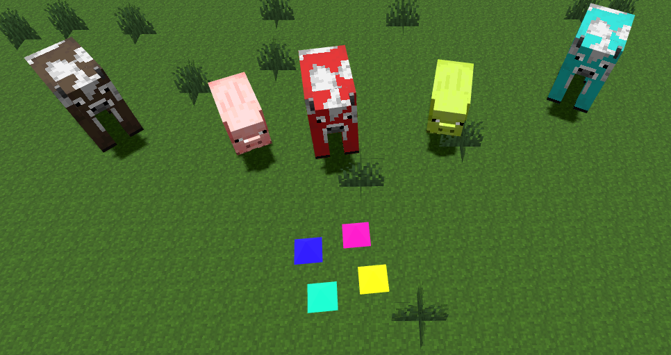

# PolyFarm


# Description

PolyFarm is a colorful, interactive, and fun Minecraft mob farm simulator.

Inspired by the colors and interactivity of the WNDR museum, this web-based Three.JS visualization puts you in control of farm animals from Minecraft.

To check out this in your browser, simply click [here](https://jasoncourtois.github.io/PolyFarm)!

To run this project locally on your machine, check out the [Installation](#installation) section below!

# Future Improvements

This project was made as a final project for CS460 at University of Massachusetts Boston. I plan on adding more features after the project's deadline such as sound, optimized texture recoloring, and a feeding/breeding mechanic.

These are all features I originally planned on being part of the original project. But as I encountered challenges during development I was not able to complete everything I planned.

# Installation

- First, install Node.js through this [link](https://nodejs.org/en/download).
    - This project was developed on Node.js v22.20.0
- Then clone the repository and run the following command in the root directory:
```
npm install
```
- Then you should be ready to run the project! Simply run the command:
```
npm run dev
```

- If you wish to edit the 3D models or animations for the animals, download blender [here](https://www.blender.org/download/)!
    - Once blender is installed, open any of the .blender files found in the public directory of this project.

# References

While creating this project I was inspired by the WNDR Museum in Boston, MA as well as a demo created by Marpi Studio.

- WNDR Museum - [Click Here](https://www.wndrmuseum.com/location/boston)

- Marpi Studio Ocean Desert - [Click Here](https://demo.marpi.pl/ocean_desert/)

All textures seen in the project were taken from Minecraft itself or one of the below wikipedia pages. The 3D models were recreated using the original Minecraft models as a visual reference.

- Minecraft Cow texture used: https://minecraft.fandom.com/wiki/Cow#Textures

- Minecraft Pig texture used = https://minecraft.fandom.com/wiki/Pig#Textures

- Minecraft Grass texture used = https://minecraft.fandom.com/wiki/Grass?file=Grass_%28item%29.png#Grass_3 

- Minecraft Grass Block (ground) texture taken as a screenshot from Minecraft Java edition version 1.8.7

I also referenced external code for converting rgb to hsv and vice versa.
My deploy.yml script was also taken from the vite.dev guidebook for deploying static sites.

- rgbToHsv and hsvToRgb = https://gist.github.com/mjackson/5311256

- Deploy.yml script = https://vite.dev/guide/static-deploy#github-pages

# Acknowledgements

As mentioned above, this project was created for the class CS460 at University of Massachusetts Boston.

- Course Site - [CS460.org](https://cs460.org)

Being able to apply everything we learned throughout the semester into a final project like this was challenging and very fun! Thank you Professor Haehn and the grading staff for creating such a fun and memorable course. If any future UMB Computer Science students are reading this, take this course when you can!!